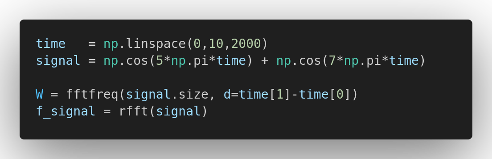
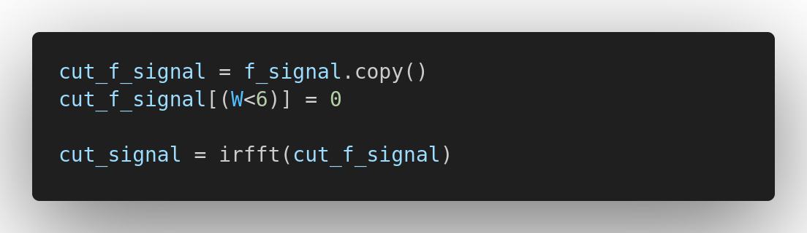

# signal-frequency-filtering-example
A simple demonstration of signal frequency filtering using Python.


## Step 1. Signal Generation
1. Generate a linear space-time starting value of the sequence from 0, to the stop sequence at 10, and there are 2000 samples. 
2. Generate a signal from the previous space-time with 2 frequencies with different amplitude.
3. Analyze the frequencies by applying the `Fourier Analysis`. If the length of our data is in seconds, now it is in Hertz.



## Step 2. Filtering Process
4. Cutting some frequencies from the signal.
5. Transform the result from `Frequency Domain` back to the `Spatial Domain`.



## Step 3. Visualization
6. Plotting the process as a result from the begining of this readme file :)
7. For the fast way to share, the code is in below:

```python
import numpy as np
from scipy.fftpack import rfft, irfft, fftfreq
import pylab as plt

time   = np.linspace(0,10,2000)
signal = np.cos(5*np.pi*time) + np.cos(7*np.pi*time)

W = fftfreq(signal.size, d=time[1]-time[0])
f_signal = rfft(signal)

# If our original signal time was in seconds, this is now in Hz    
cut_f_signal = f_signal.copy()
cut_f_signal[(W<6)] = 0

cut_signal = irfft(cut_f_signal)

plt.subplot(221)
plt.plot(time,signal)
plt.subplot(222)
plt.plot(W,f_signal)
plt.xlim(0,10)
plt.subplot(223)
plt.plot(W,cut_f_signal)
plt.xlim(0,10)
plt.subplot(224)
plt.plot(time,cut_signal)
plt.show()
```
